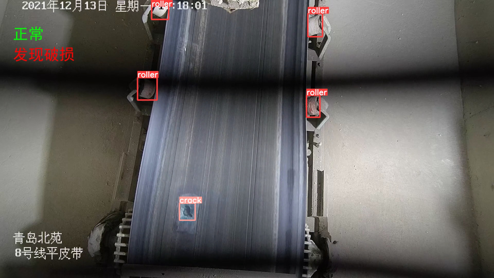
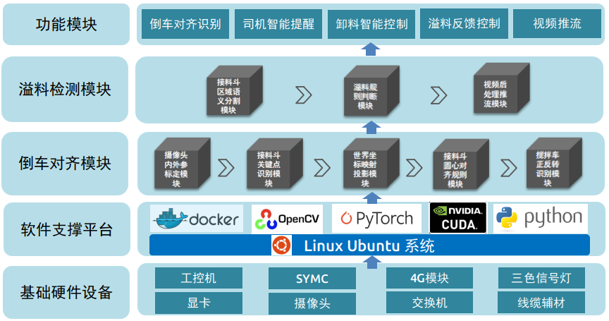
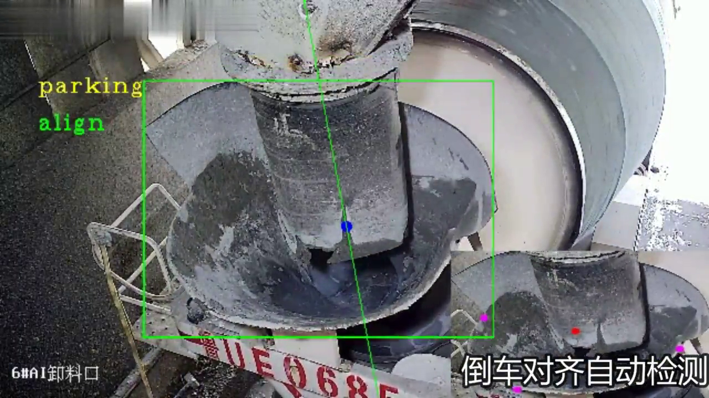
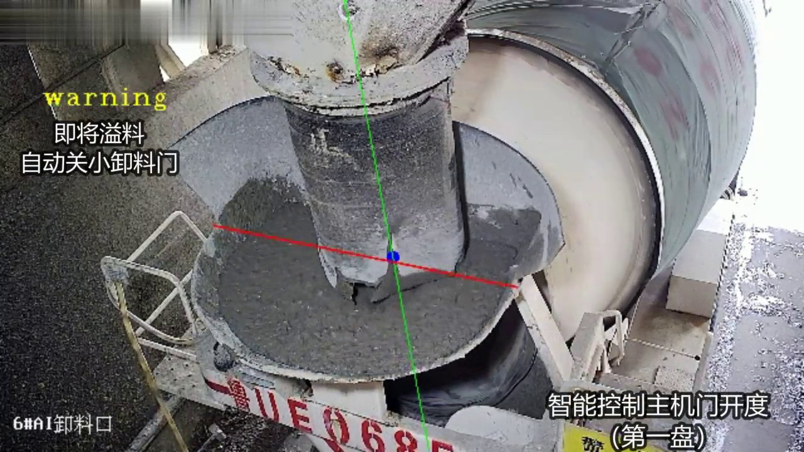

## Welcome to My GitHub Pages

### Hi there 👋

✍️&nbsp;&nbsp;Hello，I'm Kevin! Graduated from the School of Artificial Intelligence,

&emsp;&emsp;Southwest Jiaotong University, majoring in software engineering,

&emsp;&emsp;I am working on the research of artificial intelligence and intelligent detection application technology.

&emsp;&emsp;We're making the world a better place. Through constructing elegant hierarchies for maximum code reuse and extensibility.

&emsp;&emsp;It's too late to start, but it's never too late. Spring flowers and autumn fruits, hard work will definitely pay off ...

✍️&nbsp;&nbsp;嗨，我是曹科，毕业于西南交通大学人工智能学院软件工程专业，

&emsp;&emsp;正在致力于人工智能与智能检测应用技术的研究。

&emsp;&emsp;我们正在让这个世界变得更加美好，通过代码的重复使用和延展构建完美体系，

&emsp;&emsp;开始太晚，但总归不算太迟。春华秋实，努力就一定会有收获。。。

## Projects

The following is a brief introduction to my personal artificial intelligence landing project.

以下是我个人人工智能落地项目的一些简单介绍。

### 1. 输料带异常状态检测系统

- 项目描述：研究院无人值守搅拌站规划项目，研发应用于全国搅拌站的皮带输料系统异常情况智能检测系统，实现皮带全流程的跑偏、破损和异物的监测，并对检测出的异常事件产生联动报警，提供图像数据回传、事件回溯等服务。

- 项目方案：

- 项目成果：已在生产环境有效监测超半年，进入全国小批推广，正在进行全国12个站点的部署工作。

- 宣传视频:

<video id="video" controls="controls" preload="none" width="512" poster="./videos/belt_15s.png">
<source id="mp4" src="./videos/belt_15s.mp4" type="video/mp4">
</video>

- 演示图片:

### 2. 搅拌站智能卸料系统

- 项目描述：研究院无人值守搅拌站规划项目，研发应用于全国搅拌站的卸料阶段车站协同的智能识别控制系统，实现对搅拌
车的倒车对齐检测、倒车对齐提示，对搅拌站的卸料自动启停、卸料溢料控制，容器化部署提高可用性，为客户提供卸料流
程全自动控制服务。

- 项目方案：

- 项目成果：已在生产环境有效实现卸料流程自动控制，为客户实现操作手减员超50%，卸料提速超50%。

- 宣传视频:

<video id="video" controls="controls" preload="none" width="512" poster="./videos/dump_122s.png">
<source id="mp4" src="./videos/dump_122s.mp4" type="video/mp4">
</video>

- 演示图片:

### 3. 混凝土塌落度在线检测系统

- 项目描述：研究院无人值守搅拌站规划项目，研发应用于全国搅拌站的塌落度在线智能识别系统，实现水泥生产质量的无接
触式检测，提供卸料中混凝土塌落度判断、生产中塌落度异常报警，为客户提供高效的生产质量监测服务。

- 项目方案：涉及机密。

- 项目成果：已立项为企业最高级别A类项目，为解决混凝土行业塌落度检测难题，提供了创新且有效的技术解决方案。

- 模型结果：

- 演示视频:

<video id="video" controls="controls" preload="none" width="512" poster="./videos/tld_28s.png">
<source id="mp4" src="./videos/tld_28s.mp4" type="video/mp4">
</video>

- 演示图片:

### Support or Contact

We-chat: Kevin_Cao_0

E-mail: kevin_cao_91@163.com

Github: https://github.com/kevincao91
